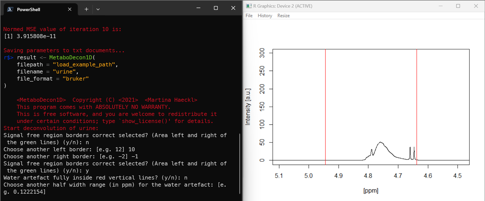

# FAQ

## FAQ

### Water Artifact

**Question:** When I choose `n` for
`Water artefact fully inside red vertical lines? (y/n)`, metabodecon
asks me to
`Choose another half width range (in ppm) for the water artefact`,
instead of left and right borders. Why is that and what should I enter
here?



**Answer:** the water signal is always centered by Bruker, so you only
have to specify the half width range to make the water area around the
midpoint wider or narrower.

### Parameter Optimization

**Question:** Why do you do exactly 10 iterations of parameter
optimization?

**Answer:** This value was determined empirically. We found that 10
iterations are enough to get a good fit and more iterations would not
improve the fit significantly, but would take longer. Obviously, a more
objective stopping criterion would be better and will likely be
implemented in a future version.

### File Structure

**Question:** What file structure is expected for `bruker` and `jcampdx`
formats?

**Answer:** The expected file structure is as follows:

``` txt
C:/bruker/urine              # data_path (user input)
├── urine_1/                 # name (user input)
│   └── 10/                  # spectroscopy_value (user input), called expno in TopSpin manual
│       ├── acqus            # acqus_file (constant)
│       └── pdata/           # processings_dir (constant)
│           └── 10/          # processing_value (user input), called procno in TopSpin manual
│               ├── 1r       # spec_file (constant)
│               └── procs    # spectrum_file (constant)
├── urine_2/...
└── ...
C:/jcampdx/urine    # data_path (user input)
├── urine_1.dx      # spectrum_file (user input)
├── urine_2.dx
└── ...
```
