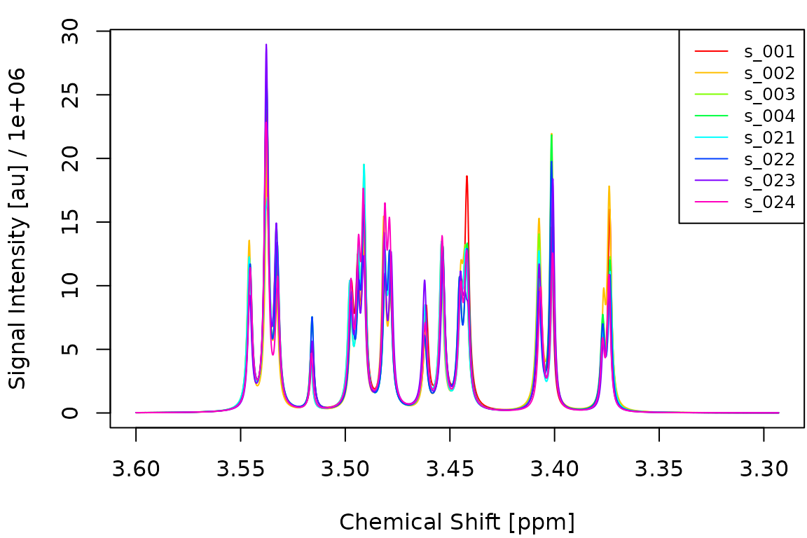
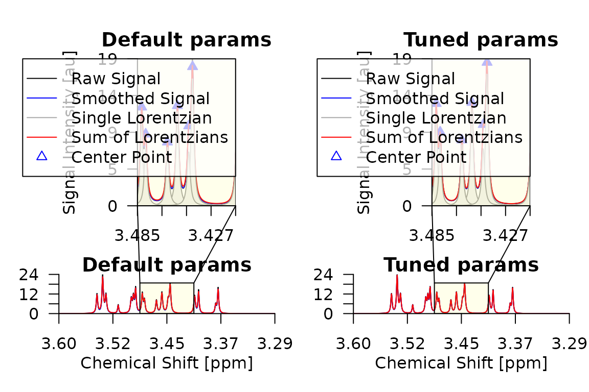

# Metabodecon Models

This article demonstrates how to use
[`fit_mdm()`](https://spang-lab.github.io/metabodecon/reference/mdm.md),
[`cv_mdm()`](https://spang-lab.github.io/metabodecon/reference/mdm.md)
and
[`benchmark_mdm()`](https://spang-lab.github.io/metabodecon/reference/mdm.md)
to build, tune and evaluate classification models on deconvoluted NMR
spectra. We simulate a toy dataset with known group differences, split
it into training and test sets, run a small grid search to find good
preprocessing parameters, and then evaluate on held-out data.

## Simulate spectra

We start by defining shared peak parameters for 40 spectra. Every
spectrum has 20 peaks with slightly varying positions, half-widths and
areas between samples. Five of these peaks carry subtle group
information: their areas differ by +/- 5% between groups A and B.

``` r
library(metabodecon)
set.seed(42)

n <- 40
npk <- 20
cs_range <- seq(from = 3.6, length.out = 2048, by = -0.00015)

# Base peak parameters (shared across all spectra)
base_x0 <- sort(runif(npk, 3.35, 3.55))
base_A <- runif(npk, 5, 15) * 1e3
base_lam <- runif(npk, 0.9, 1.3) / 1e3

# Assign group labels
group <- factor(rep(c("A", "B"), each = n / 2))

# Discriminating peak indices
diff_AB <- 1:5    # peaks with slightly different areas between groups

spectra <- vector("list", n)
for (i in seq_len(n)) {
    x0 <- base_x0 + rnorm(npk, sd = 0.0003)
    A <- base_A * runif(npk, 0.7, 1.3)
    lam <- base_lam * runif(npk, 0.9, 1.1)

    # Group-specific area shift (+/- 5%)
    if (group[i] == "A") {
        A[diff_AB] <- A[diff_AB] * 1.05
    } else {
        A[diff_AB] <- A[diff_AB] * 0.95
    }

    spectra[[i]] <- simulate_spectrum(
        name = sprintf("s_%03d", i), cs = cs_range,
        x0 = sort(x0), A = A, lambda = lam,
        noise = rnorm(length(cs_range), sd = 2000)
    )
}
class(spectra) <- "spectra"
names(group) <- get_names(spectra)
```

The following figure shows four spectra from each group overlaid on top
of each other. The subtle area differences are hard to spot visually.

``` r
idx_A <- which(group == "A")[1:4]
idx_B <- which(group == "B")[1:4]
plot_spectra(spectra[c(idx_A, idx_B)])
```



## Train/test split

We use two thirds of the data for training and one third for testing.

``` r
set.seed(1)
n_train <- round(2 / 3 * n)
train_idx <- sort(sample(n, n_train))
test_idx <- setdiff(seq_len(n), train_idx)

spectra_tr <- spectra[train_idx]
spectra_te <- spectra[test_idx]
class(spectra_tr) <- "spectra"
class(spectra_te) <- "spectra"
y_tr <- group[train_idx]
y_te <- group[test_idx]
```

## Fit a single model

[`fit_mdm()`](https://spang-lab.github.io/metabodecon/reference/mdm.md)
deconvolutes the spectra, aligns them, builds a feature matrix and fits
a lasso model via `cv.glmnet()`. Here we use the default deconvolution
parameters:

``` r
mdm_default <- fit_mdm(
    spectra_tr, y_tr,
    nfit = 3, smit = 2, smws = 5, delta = 6.4, npmax = 0,
    maxShift = 100, maxCombine = 30, verbosity = 0
)
print(mdm_default)
```

    ## metabodecon model (mdm)
    ##   npmax:         0
    ##   nfit:          3
    ##   smit:          2
    ##   smws:          5
    ##   delta:         6.4
    ##   maxShift:      100
    ##   maxCombine:    30
    ##   combineMethod: 2

## Tune preprocessing via grid search

[`cv_mdm()`](https://spang-lab.github.io/metabodecon/reference/mdm.md)
evaluates a grid of preprocessing parameter combinations. For each
configuration it builds the feature matrix, runs `cv.glmnet()` with a
fixed fold assignment, and records the held-out accuracy and AUC at
`lambda.min`. We use a deliberately small grid here to keep vignette
build time short:

``` r
pgrid <- expand.grid(
    smit = 2,
    smws = c(3, 5),
    delta = c(4, 6),
    nfit = 5,
    npmax = 0,
    maxShift = 100,
    maxCombine = 30,
    stringsAsFactors = FALSE
)
pgrid$acc <- NA_real_
pgrid$auc <- NA_real_
mdm_tuned <- cv_mdm(
    spectra_tr, y_tr,
    pgrid = pgrid,
    nfolds = 5,
    verbosity = 0
)
```

The performance grid shows how each parameter combination scored:

``` r
pg <- mdm_tuned$pgrid
pg <- pg[order(-pg$auc), ]
knitr::kable(
    head(pg, 10),
    digits = c(0, 0, 0, 0, 0, 0, 0, 3, 4),
    row.names = FALSE,
    caption = "Top 10 parameter combinations by AUC."
)
```

| smit | smws | delta | nfit | npmax | maxShift | maxCombine |   acc |    auc |
|-----:|-----:|------:|-----:|------:|---------:|-----------:|------:|-------:|
|    2 |    3 |     6 |    5 |     0 |      100 |         30 | 0.815 | 0.7944 |
|    2 |    3 |     4 |    5 |     0 |      100 |         30 | 0.815 | 0.7778 |
|    2 |    5 |     4 |    5 |     0 |      100 |         30 | 0.556 | 0.6333 |
|    2 |    5 |     6 |    5 |     0 |      100 |         30 | 0.556 | 0.6333 |

Top 10 parameter combinations by AUC.

## Compare deconvolution results

Let us compare the deconvolution of the first training spectrum using
the default parameters and the best parameters found by the grid search:

``` r
# Deconvolute first two training spectra with default and tuned parameters
pair <- spectra_tr[1:2]
class(pair) <- "spectra"

d_default <- deconvolute(
    pair, nfit = 3, smopts = c(2, 5), delta = 4, npmax = 0, verbose = FALSE
)

m <- mdm_tuned$meta
d_tuned <- deconvolute(
    pair, nfit = m$nfit, smopts = c(m$smit, m$smws),
    delta = m$delta, npmax = m$npmax, verbose = FALSE
)

par(mfrow = c(1, 2), mar = c(4, 4, 2, 1))
plot_spectrum(d_default[[1]], main = "Default params")
plot_spectrum(d_tuned[[1]], main = "Tuned params")
```



## Inspect lasso features

The non-zero coefficients of the lasso model reveal which chemical shift
positions are most important for distinguishing the two groups:

``` r
cf <- coef(mdm_tuned)
cf_nz <- cf[cf[, 1] != 0, , drop = FALSE]
knitr::kable(
    data.frame(
        feature = rownames(cf_nz),
        coefficient = round(cf_nz[, 1], 4)
    ),
    row.names = FALSE,
    caption = "Non-zero lasso coefficients at lambda.min."
)
```

| feature     | coefficient |
|:------------|------------:|
| (Intercept) |     69.1303 |
| 3.5331      |      0.0002 |
| 3.4941      |     -0.0005 |
| 3.4812      |     -0.0002 |
| 3.4452      |     -0.0001 |
| 3.4422      |     -0.0001 |
| 3.4071      |     -0.0003 |
| 3.40065     |     -0.0004 |
| 3.3774      |     -0.0004 |
| 3.3735      |     -0.0002 |

Non-zero lasso coefficients at lambda.min.

## Predict test samples

We use
[`predict.mdm()`](https://spang-lab.github.io/metabodecon/reference/mdm_methods.md)
to classify the held-out test spectra. This internally deconvolutes and
aligns them against the reference spectrum stored in the model:

``` r
preds <- predict(mdm_tuned, spectra_te, type = "all", verbosity = 0)
```

    ## 2026-04-10 01:12:41.44 Deconvoluting 13 spectra with 1 nworkers
    ## 2026-04-10 01:12:41.54 Aligning spectra with 1 nworkers
    ## 2026-04-10 01:12:41.61 Predicting with s=lambda.min

``` r
results <- data.frame(
    sample = get_names(spectra_te),
    true = y_te,
    predicted = preds$class,
    prob_B = round(preds$prob, 3)
)
```

``` r
acc <- mean(preds$class == y_te)
auc <- metabodecon:::AUC(y_te, preds$prob)
cat(sprintf("Test accuracy: %.1f%%\n", acc * 100))
```

    ## Test accuracy: 76.9%

``` r
cat(sprintf("Test AUC:      %.4f\n", auc))
```

    ## Test AUC:      0.7750

``` r
knitr::kable(
    table(True = y_te, Predicted = preds$class),
    caption = "Confusion matrix on test set."
)
```

|     |   A |   B |
|:----|----:|----:|
| A   |   6 |   2 |
| B   |   1 |   4 |

Confusion matrix on test set.

## Benchmark with nested cross-validation

To obtain an unbiased estimate of end-to-end predictive performance,
[`benchmark_mdm()`](https://spang-lab.github.io/metabodecon/reference/mdm.md)
wraps
[`cv_mdm()`](https://spang-lab.github.io/metabodecon/reference/mdm.md)
in an outer cross-validation loop. The outer held-out fold is never seen
during preprocessing or model fitting, so the resulting accuracy and AUC
are honest estimates.

A typical call looks like this:

``` r
bm <- benchmark_mdm(
    spectra_tr, y_tr,
    pgrid = pgrid,
    nfo = 3,        # 3 outer folds
    nfl = 5,        # 5 inner folds for cv.glmnet
    nwo = 3,        # 1 outer worker per fold
    nwi = 4         # 4 inner workers for deconvolution
)
# bm$predictions contains per-sample held-out predictions
# bm$models contains the cv_mdm model for each outer fold
cat(sprintf(
    "Nested CV accuracy: %.1f%%\n",
    mean(bm$predictions$true == bm$predictions$pred) * 100
))
```

Note that
[`benchmark_mdm()`](https://spang-lab.github.io/metabodecon/reference/mdm.md)
is computationally expensive because it runs the full grid search for
each outer fold. We recommend running it on a machine with enough RAM
and CPU cores to use at least as many outer workers (`nwo`) as outer
folds (`nfo`). It is therefore not executed in this vignette.
