# MetaboDecon1D

## MetaboDecon1D Usage Example

The `MetaboDecon1D` package (v0.2.2) is the predecessor of this package
and can be downloaded from
[uni-regensburg.de/medicine/functional-genomics/staff/prof-wolfram-gronwald/software](https://www.uni-regensburg.de/medicine/functional-genomics/staff/prof-wolfram-gronwald/software/index.html).
We include this usage example in here so we can easily reference old
behaviour and point out added features in `metabodecon` (v1.x).

### Install the package

1.  Open the following link in your browser:
    [uni-regensburg.de/medicine/functional-genomics/staff/prof-wolfram-gronwald/software](https://www.uni-regensburg.de/medicine/functional-genomics/staff/prof-wolfram-gronwald/software/index.html)
2.  Click [MetaboDecon1D: An R-package for the Deconvolution and
    Integration of 1D NMR
    data](https://genomics.ur.de/software/NMR/MetaboDecon1D/)
3.  Download
    [MetaboDecon1D_0.2.2.tar.gz](https://genomics.ur.de/software/NMR/MetaboDecon1D/MetaboDecon1D_0.2.2.tar.gz)
4.  Start an R session and enter command
    `install.packages("C:/Users/tobi/Downloads/MetaboDecon1D_0.2.2.tar.gz", repos = NULL, type = "source")`
    (replace `C:/Users/tobi/Downloads/MetaboDecon1D_0.2.2.tar.gz` with
    the path to the downloaded file on your computer)

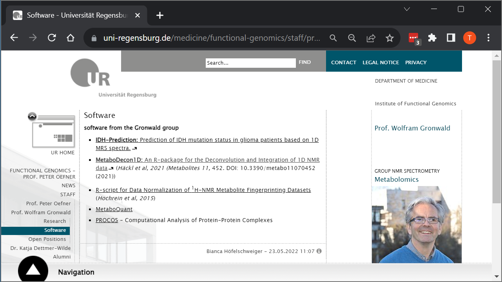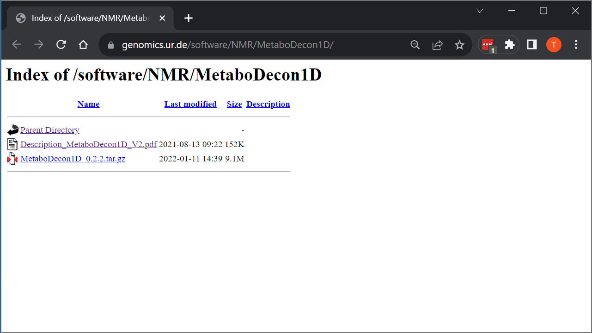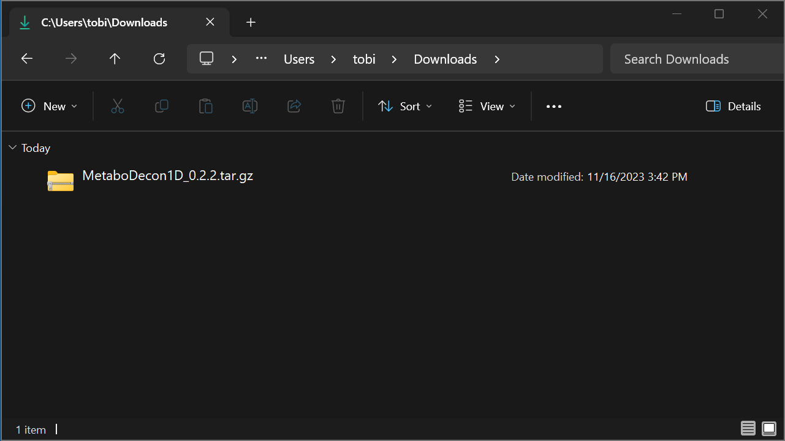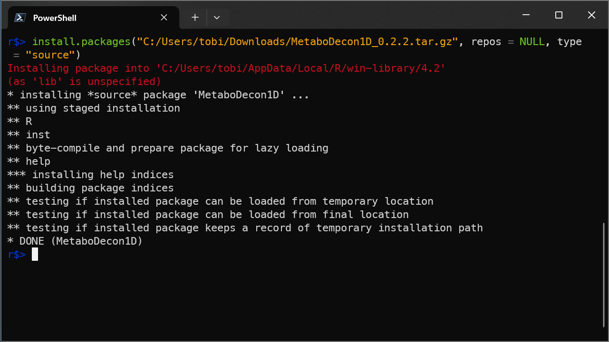

### Load package

``` r
library(MetaboDecon1D)
```

### Deconvolute one spectrum in Bruker format

``` r
result <- MetaboDecon1D(
    filepath = "load_example_path",
    filename = "example_human_urine_spectrum",
    file_format = "bruker"
)
```

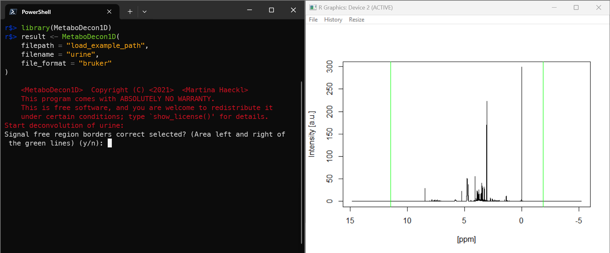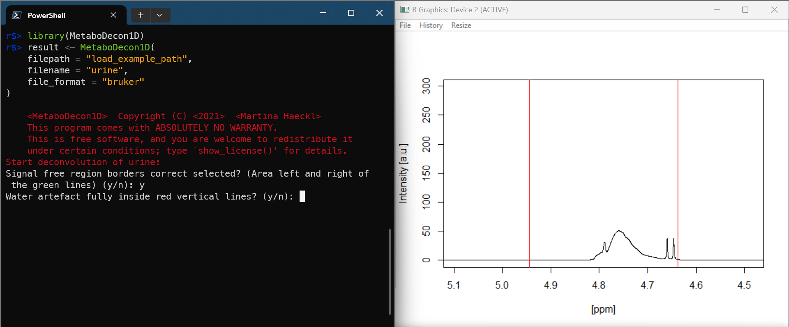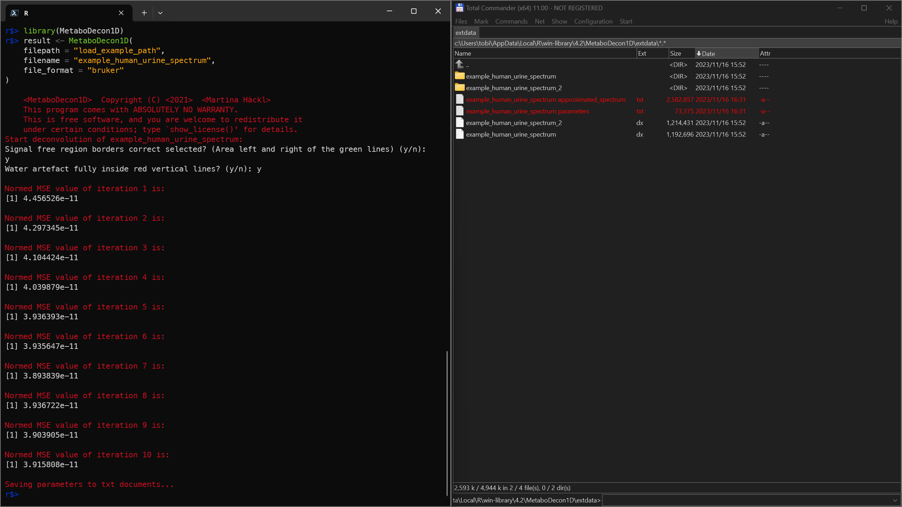

### Visualize results and store plots as png

``` r
str(result)
plot_triplets(result)
plot_lorentz_curves_save_as_png(result)
plot_spectrum_superposition_save_as_png(result)
```

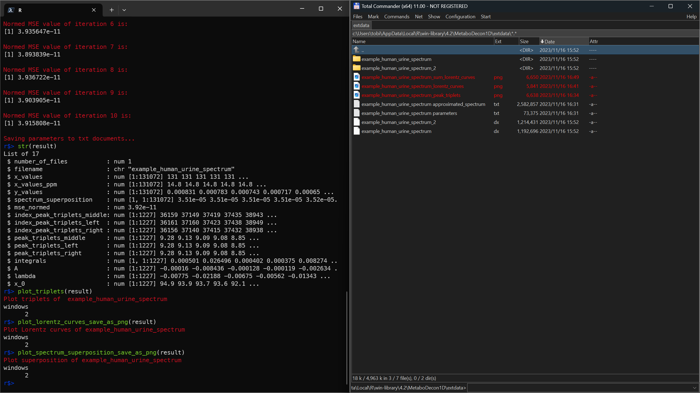

4_plots.png

### Deconvolute one spectrum in jcampdx format

``` r
result <- MetaboDecon1D(
    filepath = "load_example_path",
    filename = "example_human_urine_spectrum.dx",
    file_format = "jcampdx"
)
str(result)
```

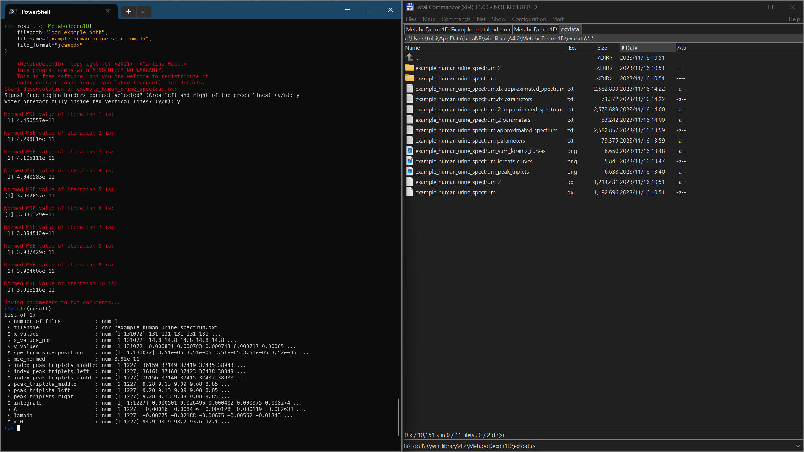

### Deconvolute multiple spectra in Bruker format

``` r
result <- MetaboDecon1D(
    filepath = "load_example_path",
    file_format = "bruker"
)
str(result)
```

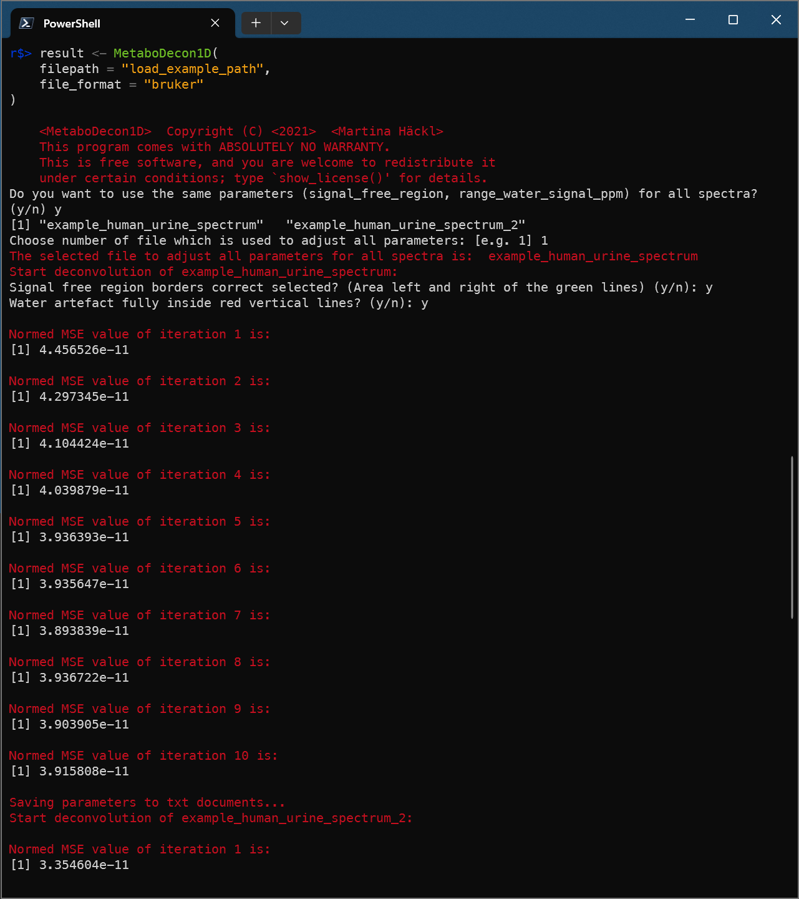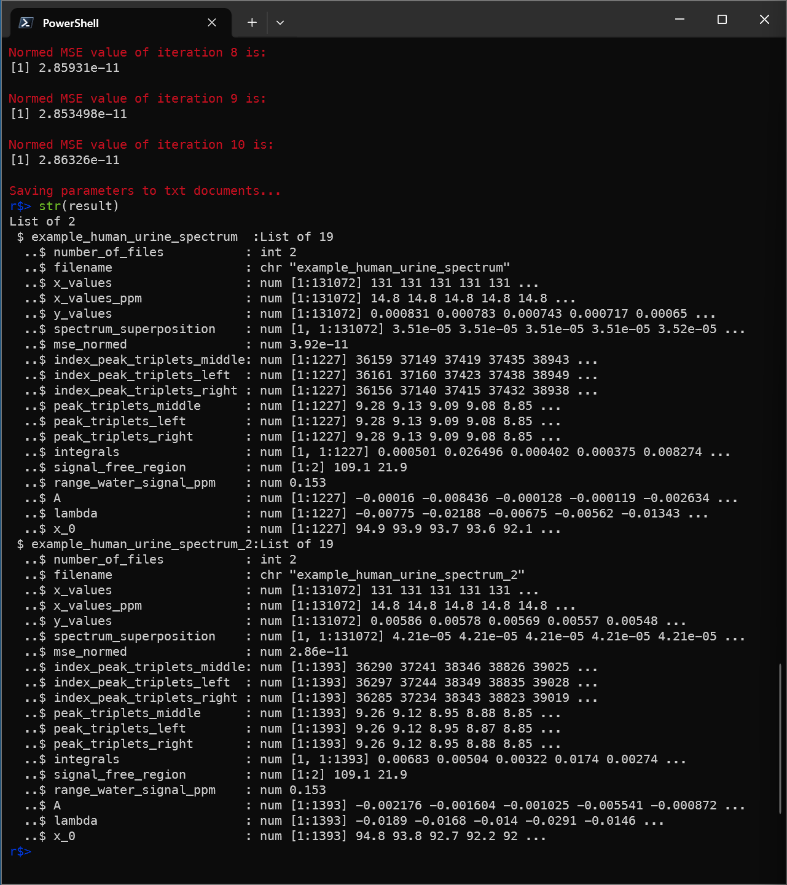

### Deconvolute multiple spectra in jcampdx format

``` r
jcamp_results <- MetaboDecon1D(
    filepath = "load_example_path",
    file_format = "jcampdx"
)
plot_triplets(jcamp_results)
plot_lorentz_curves_save_as_png(jcamp_results)
plot_spectrum_superposition_save_as_png(jcamp_results)
```

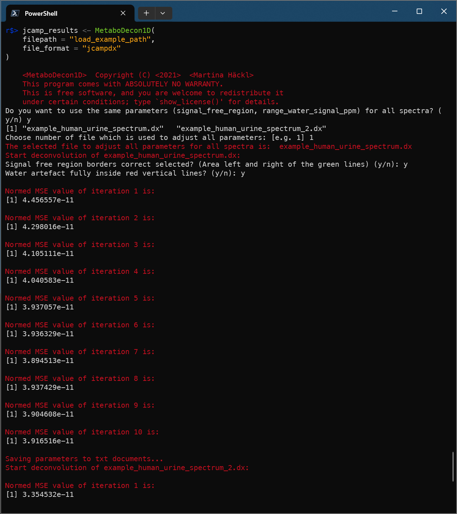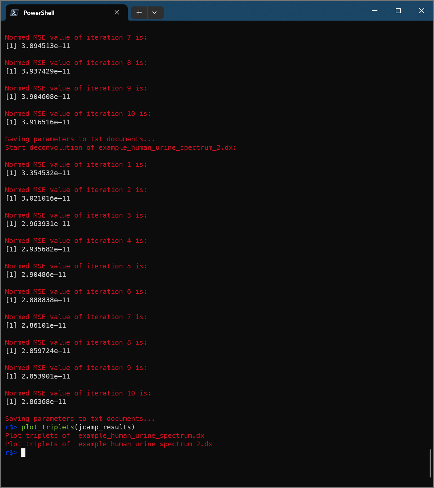
