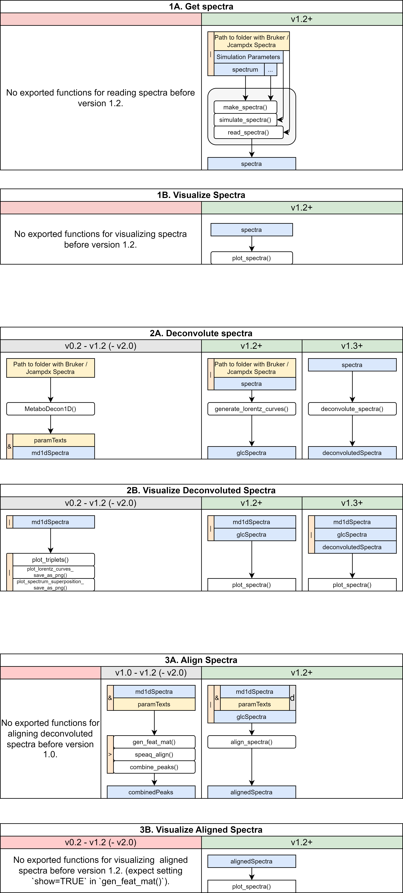

Metabodecon introduces a set of classes to highlight the presence of certain elements in corresponding objects.

The order of elements may vary between different versions of Metabodecon, thus elements should always be accessed by name, for example, using `x$si` or `x[["cs"]]`.
A short description of each class is given in the [Listing: Class Overview](#listing-class-overview) below.

More detailed descriptions are given in [Single Object Classes](#single-object-classes) and [Multiple Object Classes](#multiple-object-classes).

A grafical visualization of the classes and the corresponding functions is given in [Figure: Metabodecon Workflow](#figure-metabodecon-workflow).

**Listing: Class Overview** 

-  `spectrum`: One NMR spectrum
-  `decon1`: One deconvoluted NMR spectrum stored in [MetaboDecon1D()] format
-  `decon2`: One deconvoluted NMR spectrum stored in [generate_lorentz_curves()] format
-  `decon3`: One deconvoluted NMR spectrum stored in [deconvolute_spectrum()] format
-  `alignment`: One aligned NMR spectrum
-  `spectra`: List of multiple NMR spectra
-  `decons1`: List of multiple deconvoluted NMR stored in [MetaboDecon1D()] format
-  `decons2`: List of multiple deconvoluted NMR stored in [generate_lorentz_curves()] format
-  `decons3`: List of multiple deconvoluted NMR stored in [deconvolute_spectrum()] format
-  `alignments`: List of multiple aligned NMR spectra

**Figure: Metabodecon Workflow** 

# Single Object Classes

## spectrum

A 'spectrum' object represents a single NMR spectrum.
It is a list with class attribute `"spectrum"` and the following elements in arbitrary order:

- `si`: Signal intensities in arbitrary units (au), ordered from highest to lowest corresponding chemical shift.
- `cs`: Vector of "chemical shifts" in parts per pillion (ppm). Must be of the same length as `si` and `fq`.
- `fq`: Vector of "frequencies" in Hertz (Hz). Must be of the same length as `si` and `cs`.
- `name`: The name of the spectrum, e.g. `"Blood 1"` or `"Urine Mouse X23D"`.
- `path`: The path of the file/folder containing the spectrum data. E.g. `"example_datasets/jcampdx/urine/urine_1.dx"` or `"example_datasets/bruker/urine/urine"`.
- `type`: The type of experiment, e.g. `"H1 CPMG"` or `"H1 NOESY"`.
- `mfs`: Magnetic field strength in Tesla, e.g. `14.1`.

## decon3

A 'Deconvoluted spectrum' object represents a single deconvoluted NMR spectrum.
It is a list with class attribute `"decon3"` and the following elements in arbitrary order:

- `spec`: The input NMR spectrum.
- `args`: The parameters used for the deconvolution:
  - `smopts`: The smoothing parameters used for the deconvolution.
  - `delta`: The threshold used for peak filtering.
  - `nfit`: The number of fitting iterations.
  - `sfr`: Borders of the signal free region in ppm.
  - `wsr`: Borders of the water signal region in ppm.
- `pks`: Results of peak detection:
  - `ct`: Index of peak centers.
  - `bl`: Index of left peak borders.
  - `br`: Index of right peak borders.
- `si`: Signal intensities used during deconvolution:
  - `sm`: After smoothing the raw signal intensities.
  - `sup`: As superposition of Lorentz curves.
- `lc`: Lorentz curve parameters fitted during parameter approximation:
  - `am`: Amplitude parameter.
  - `hw`: Halfwidth parameter.
  - `ct`: Center parameter.
- `mse`: Mean squared error between the raw signal intensities `spec$si` and the superposition of lorentz curves `sup$si`.

## alignment

An `alignment` object represents a single deconvoluted NMR spectrum after alignment.
It is a list with class attribute `"alignment"` and the following elements in arbitrary order:

- `decons`: The deconvoluted NMR spectra before alignment. This can be an object of class `decons1`, `decons2` or .
- `lc`: Lorentz curves after alignment:
  - `am`: Amplitude parameter.
  - `hw`: Halfwidth parameter.
  - `ct`: Center parameter.
- `si`: Signal intensities after alignment.

## decon1

An `decon1` object represents a single deconvoluted NMR spectrum and is a list with the following elements:

- `filename`: Name of the analyzed spectrum.
- `x_values`: Scaled datapoint numbers (SDP). Datapoints are numbered in descending order going from N to 0, where N equals the total amount of data points. Scaled data point numbers are obtained by dividing these numbers by the scale factor of the x-axis. I.e., for a spectrum with 131072 datapoints and a scale factor of 1000, the first scale datapoint has value 131.071 and the last one has value 0.
- `x_values_ppm`: The chemical shift of each datapoint in ppm (parts per million).
- `y_values`: The scaled signal intensity (SSI) of each datapoint. Obtained by reading the raw intensity values from the provided `data_path` as integers and dividing them scale factor of the y-axis.
- `spectrum_superposition`: Scaled signal intensity obtained by calculating the sum of all estimated Lorentz curves for each data point.
- `mse_normed`: Normalized mean squared error. Calculated as \mjeqn{\frac{1}{n} \sum_{i=1}^{n} (z_i - \hat{z}_i)^2}{1/n * sum((z_i - zhat_i)^2)} where \mjeqn{z_i}{z_i} is the normalized, smoothed signal intensity of data point i and \mjeqn{\hat{z}_i}{zhat_i} is the normalized superposition of Lorentz curves at data point i. Normalized in this context means that the vectors were scaled so the sum over all data points equals 1.
- `peak_triplets_middle`: Chemical shift of peak centers in ppm.
- `peak_triplets_left`: Chemical shift of left peak borders in ppm.
- `peak_triplets_right`: Chemical shift of right peak borders in ppm.
- `index_peak_triplets_middle`: Datapoint numbers of peak centers.
- `index_peak_triplets_left`: Datapoint numbers of left peak borders.
- `index_peak_triplets_right`: Datapoint numbers of right peak borders.
- `integrals`: Integrals of the Lorentz curves.
- `signal_free_region`: Borders of the signal free region of the spectrum in scaled datapoint numbers. Left of the first element and right of the second element no signals are expected.
- `range_water_signal_ppm`: Half width of the water signal in ppm. Potential signals in this region are ignored.
- `A`: Amplitude parameter of the Lorentz curves. Provided as negative number to maintain backwards compatibility with MetaboDecon1D. The area under the Lorentz curve is calculated as \mjeqn{A \cdot \pi}{A * pi}.
- `lambda`: Half width of the Lorentz curves in scaled data points. Provided as negative value to maintain backwards compatibility with MetaboDecon1D. Example: a value of -0.00525 corresponds to 5.25 data points. With a spectral width of 12019 Hz and 131072 data points this corresponds to a halfwidth at half height of approx. 0.48 Hz. The corresponding calculation is: (12019 Hz / 131071 dp) * 5.25 dp.
- `x_0`: Center of the Lorentz curves in scaled data points.

Objects of this type can be created using `MetaboDecon1D()` and don't have any class attribute. Therefore, you cannot use `inherits()` or `class` to check for this type. Instead, you can use, `is_mdod()`, which will check the element names and element types of the provided object to determine if it's a `decon1` object or not.

## decon2

A `decon2` object represents a single deconvoluted NMR spectrum and is a list with class attribute `decon2` and has all elements of class `decon1` plus the following additional elements:

- `y_values_raw`: The raw signal intensity of each datapoint
- `x_values_hz`: The frequency of each datapoint in Hz
- `mse_normed_raw`: Normalized mean squared error when comparing the raw signal intensities with the superposition of Lorentz curves.
- `x_0_hz`: Center of the Lorentz curves in Hz.
- `x_0_dp`: Center of the Lorentz curves in data points.
- `x_0_ppm`: Center of the Lorentz curves in ppm.
- `A_hz`: Amplitude parameter of the Lorentz curves in Hz.
- `A_dp`: Amplitude parameter of the Lorentz curves in data points.
- `A_ppm`: Amplitude parameter of the Lorentz curves in ppm.
- `lambda_hz`: Half width of the Lorentz curves in Hz.
- `lambda_dp`: Half width of the Lorentz curves in data points.
- `lambda_ppm`: Half width of the Lorentz curves in ppm.

Objects of this type can be created using [generate_lorentz_curves()] from 'metabodecon' v1.2 or greater.

# Multiple Object Classes

## spectra

A 'spectra' object represents one or more NMR spectra and is a list with class attribute `"spectra"` that contains exclusively [spectrum] objects as elements.

## alignments

A 'alignments' object represents one or more deconvoluted and aligned NMR spectra and is a list with class attribute `"alignments"` that contains exclusively [alignment] objects as elements.

## decons1

A 'decons1' object represents one or more deconvoluted NMR spectra and is a list that contains exclusively [decon1] objects as elements.

It does not have a specific class attribute, so you can't use `class()` or `inherits()` to check for this type. Function `is_decons1()` can be used to test whether an object is of this type by checking the element names and element types of the provided object.

## decons2

A 'decons2' object represents one or more deconvoluted NMR spectra and is a list with class attribute `"decons2"` that contains exclusively [decon2] objects as elements.

## decons3

A 'decons3' object represents one or more deconvoluted NMR spectra and is a list with class attribute `"decons3"` that contains exclusively [decon3] objects as elements.

# Internal Classes

The following classes are used internally by MetaboDecon and should not be used directly by the user. They are documented here to provide interested users with insight into the package's architecture and to allow advanced users to extend its functionality.

| Name   | Description                                 |
| ------ | ------------------------------------------- |
| gspec  | "Generate-Lorentz-Curves-Internal-Spectrum" |
| gspecs | List of `gspecs`                            |

<!-- Reference Links -->

[spectrum]: #spectrum
[decon3]: #decon3
[alignment]: #alignment
[decon1]: #decon1
[decon2]: #decon2
[spectra]: #spectra
[decons3]: #decons3
[alignments]: #alignments
[decons1]: #decons1
[decons2]: #decons2