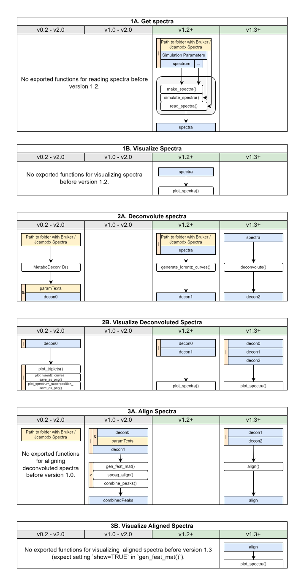

The original MetaboDecon1D package (v0.2.2) provided four functions for
deconvoluting spectra and visualizing results. With the introduction of
metabodecon (v1.x), new functions for aligning deconvoluted spectra were added,
along with improved replacements for the deconvolution functions. To maintain
backwards compatibility, the old deconvolution functions are still available but
marked as deprecated. These old functions will be removed entirely in
Metabodecon v2.0.

A tabular overview of function introductions, deprecations, and scheduled
removals is provided in [Table 1: Version Matrix](#table-1-version-matrix).

A similar graphical representation with additional information about accepted
and returned types is provided in
[Figure 1: Metabodecon Workflow](#figure-1-metabodecon-workflow).

# Table 1: Version Matrix

| Topic | Function                        | 0.2 | 1.0 | 1.2 | 1.3 | 2.0 |
| ----- | ------------------------------- | --- | --- | --- | --- | --- |
| decon | MetaboDecon1D                   | s   | s   | s   | d   | -   |
| decon | generate_lorentz_curves         | -   | s   | s   | s   | d   |
| decon | deconvolute                     | -   | -   | x   | x   | s   |
| plot  | calculate_lorentz_curves        | s   | s   | s   | d   | -   |
| plot  | plot_lorentz_curves_save_as_png | s   | s   | s   | d   | -   |
| plot  | plot_triplets                   | s   | s   | s   | d   | -   |
| plot  | plot_spectrum                   | -   | -   | x   | s   | s   |
| plot  | plot_spectra                    | -   | -   | x   | s   | s   |
| align | combine_peaks                   | -   | s   | s   | d   | -   |
| align | gen_feat_mat                    | -   | s   | s   | d   | -   |
| align | get_ppm_range                   | -   | s   | s   | d   | -   |
| align | speaq_align                     | -   | s   | s   | d   | -   |
| align | align                           | -   | -   | x   | x   | s   |
| data  | get_data_dir                    | -   | s   | s   | d   | -   |
| data  | datadir                         | -   | -   | s   | s   | s   |
| data  | datadir_persistent              | -   | -   | s   | s   | s   |
| data  | datadir_temp                    | -   | -   | s   | s   | s   |
| data  | download_example_datasets       | -   | -   | s   | s   | s   |

* -: internal or not available in package
* ?: not yet decided
* d: deprecated
* s: stable
* x: experimental

# Figure 1: Metabodecon Workflow

# Table 2: Feature Matrix

| Feature                          | BWC  | F1  | F2  | F3  | Issue        |
| -------------------------------- | ---- | --- | --- | --- | ------------ |
| Doesn't write to disk by default | semi | x   | x   | x   | CRAN-8     |
| Doesn't change wd or global opts | semi | x   | x   | x   | CRAN-9     |
| Uses faster peak selection       | yes  |     | x   | x   | CHECK-7    |
| Batch Mode                       | yes  |     | x   | x   | FEATURE-3  |
| Parallelized                     | yes  |     | x   | x   | FEATURE-4  |
| Improved plotting speed          | yes  |     | x   | x   | REFACTOR-4 |
| Uses micro functions             | yes  |     | x   | x   | REFACTOR-7 |
| Doesn't show License             | semi |     | x   | x   | REFACTOR-2 |
| Prints timestamps                | semi |     | x   | x   | REFACTOR-2 |
| Uses correctly scaled y values   | no   |     |     | x   | CHECK-1    |
| Uses correct sfr calculation     | no   |     |     | x   | CHECK-2    |
| Uses correct ws calculation      | no   |     |     | x   | CHECK-3    |
| Uses dynamic signal removal      | no   |     |     | x   | CHECK-5    |
| Uses improved return list        | no   |     |     | x   | FEATURE-7  |
| Uses faster smoothing            | no   |     |     | x   | REFACTOR-5 |
| Does all calculations in ppm     | no   |     |     | x   | REFACTOR-6 |

- BWC == backwards compatible
- F1 == MetaboDecon1D
- F2 == generate_lorentz_curves
- F3 == deconvolute_ispecs
- The faster peak selection implementation also fixes an indexing bug, which in
  most cases shouldn't have any effect, but in some rare cases might cause
  one peak to be missed.

