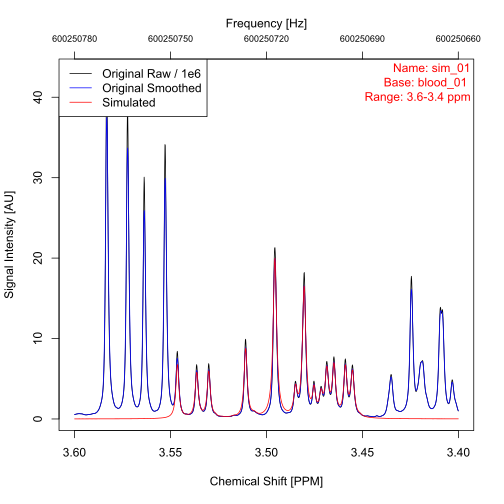
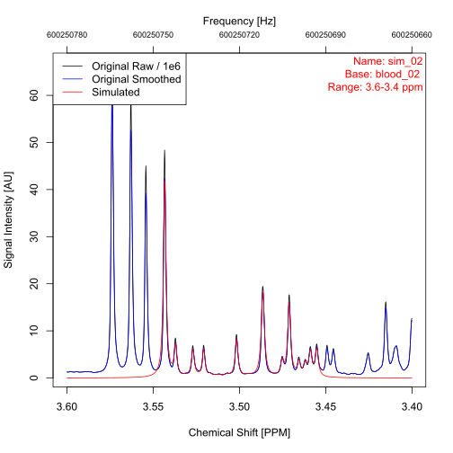

```{r knitr-setup, include = FALSE}
knitr::opts_chunk$set(collapse = TRUE, comment = "#>", eval = FALSE)
```

The [metabodecon repository](https://github.com/spang-lab/metabodecon) contains a selection of example datasets. This article describes each of these datasets in details, i.e.

- which and how many samples are included
- how they were measured
- how you can access the dataset

# The blood dataset <a id="blood"></a>

The _blood_ dataset contains 16 one-dimensional CPMG NMR-spectra of human blood plasma in Bruker format. It can be found in folder [misc/datasets/blood](https://github.com/spang-lab/metabodecon/tree/main/misc/datasets/blood) in the _metabodecon repository_.

# The urine dataset <a id="urine"></a>

The _urine_ dataset contains two one-dimensional NOESY NMR-spectra of urine, available in both Bruker and jcamp-dx format. They can be found in folder [misc/datasets/urine](https://github.com/spang-lab/metabodecon/tree/main/misc/datasets/urine) in the _metabodecon repository_.

# The sim dataset <a id="sim"></a>

There are scenarios, where it is useful to work with simulated datasets, instead of real data, e.g.

- When you need to know the underlying distribution of the data, to be able to check whether a function works as expected
- To speed up testcases and examples, where a few datapoints are sufficient to test a function

For such cases, `metabodecon` comes with a one simulated dataset, called _sim_, which was generated by applying the following steps to each spectrum of the [blood](#blood) dataset:

1. Deconvolute spectrum using `generate_lorentz_curves()` with default parameters
2. Extract Lorentz curve parameters for all peaks between 3.55 and 3.45 ppm
3. Use ppm values between 3.6 and 3.4 ppm as chemical shifts for simulated spectrum [^1]
4. Calculate signal intensity at each chemical shift as superposition of Lorentz curves
5. Add random noise to simulated spectrum [^2]

The first two of the 16 simulated spectra are plotted [below](#fig-simulated-datasets). For further details about the simulation process, see the source code of function [simulate_spectrum()](https://github.com/spang-lab/metabodecon/blob/main/R/test_helpers.R).

<figure id="fig-simulated-datasets" style="border: 1px solid #ccc; padding: 10px; display: flex; flex-wrap: wrap; justify-content: space-between;">
  
  
  <figcaption style="text-align: center;">
    <strong>Figure:</strong> The first two simulated datasets from the [sim](#sim).
  </figcaption>
</figure>

[^1]: Given, that all blood spectra have 131072 datapoints over a range of approx. 20 ppm (14.8 ppm to -5.2), we get approx. 1310 datapoints per 0.2 ppm interval (3.6 - 3.4 ppm), i.e., the resolution of the simulated spectra is kept constant. Sidenote: for the blood spectra the 14.8 to -5.2 ppm range corresponds to a 600.244 MHz to 600.256 MHz range and a magnetic field strength of 14.1 T, i.e., the 3.6 to 3.4 ppm range corresponds to a 600.250660 MHz to 600.250780 MHz range.
[^2]: The standard deviation (SD) of the noise was calculated as SD of signal intensities from the signal free region.

# How to download datasets

Due to the size constraints for R packages, most of the above mentioned datasets are not included by default when the package is installed, but must be explicitly downloaded afterwards. This can be done via command `download_example_datasets()`:

```{r, message=FALSE}
library(metabodecon)
# Set persistent = TRUE to store the files at a persistent location. This way,
# the next time you call `download_example_datasets()`, the files will not be
# downloaded again.
path <- download_example_datasets(persistent = FALSE)
tree(path)
```

Spectra that come pre-installed with the package and do not require a separate download, are:

- all spectra from the [sim](#sim) dataset
- spectra from [urine](#urine) dataset in Bruker format
- the first spectrum from [urine](#urine) dataset in jcamp-dx format
