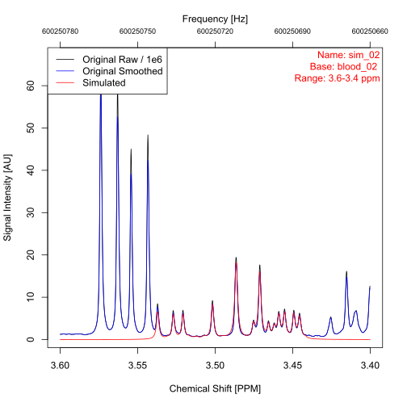

```{r knitr-setup, include = FALSE}
knitr::opts_chunk$set(collapse = TRUE, comment = "#>", eval = FALSE)
```

The [metabodecon repository](https://github.com/spang-lab/metabodecon) contains
a selection of example datasets. This article describes each of these datasets
in details, i.e.

- which and how many samples are included
- how they were measured
- how you can access the dataset

# The Blood dataset <a id="blood"></a>

The _blood_ dataset contains 16 one-dimensional CPMG NMR-spectra of human blood
plasma in Bruker format. It can be found in folder
[misc/datasets/blood](https://github.com/spang-lab/metabodecon/tree/main/misc/datasets/blood)
in the _metabodecon repository_.

# The Urine dataset <a id="urine"></a>

The _urine_ dataset contains two one-dimensional NOESY NMR-spectra of urine,
available in both Bruker and jcamp-dx format. They can be found in folder
[misc/datasets/urine](https://github.com/spang-lab/metabodecon/tree/main/misc/datasets/urine)
in the _metabodecon repository_.

# The Sim dataset <a id="sim"></a>

There are scenarios where it is useful to work with simulated datasets instead
of real data, such as:

- When you need to know the underlying distribution of the data to check whether
  a function works as expected.
- To speed up test cases and examples where a few data points are sufficient to
  test a function.

For such cases, `metabodecon` includes a simulated dataset called _sim_, which
was generated by applying the following steps to each spectrum of the
[blood](#blood) dataset:

1. Deconvolute spectrum using `generate_lorentz_curves()` with default
   parameters
2. Extract Lorentz curve parameters for all peaks between 3.52 and 3.37 ppm
3. Generate 2048 equidistant chemical shift values between 3.59 and 3.28 ppm[^1]
4. Calculate the signal intensity at each chemical shift as superposition of
   Lorentz curves
5. Add random noise to the simulated spectrum [^2]

The first two of the 16 simulated spectra are plotted
[below](#fig-simulated-datasets). For further details about the simulation
process, see the source code of function
[simulate_spectrum()](https://github.com/spang-lab/metabodecon/blob/main/R/test_helpers.R).

<figure id="fig-simulated-datasets" style="border: 1px solid #ccc; padding: 10px; display: flex; flex-wrap: wrap; justify-content: space-between;">
  
  
  <figcaption style="text-align: center;">
    <strong>Figure:</strong> The first two simulated datasets from the [sim](#sim).
  </figcaption>
</figure>

[^1]: The blood spectra have 131072 datapoints per 20 ppm (14.8 ppm to -5.2),
    i.e. ≈ 2000 datapoints per 0.3 ppm. The Sim spectra also have ≈ 2000
    datapoints per 0.3 ppm, i.e., the resolution between the two datasets is
    kept constant.
[^2]: The standard deviation (SD) of the noise was calculated as SD of signal
    intensities from the signal free region.

# How to download datasets

Due to the size constraints for R packages, most of the above mentioned datasets
are not included by default when the package is installed, but must be
explicitly downloaded afterwards. This can be done via command
`download_example_datasets()`:

```{r, message=FALSE}
library(metabodecon)
# Set persistent = TRUE to store the files at a persistent location. This way,
# the next time you call `download_example_datasets()`, the files will not be
# downloaded again.
path <- download_example_datasets(persistent = FALSE)
tree(path)
```

Spectra that come pre-installed with the package and do not require a separate
download, are:

- All 16 spectra from the [sim](#sim) dataset
- The two spectra from the [urine](#urine) dataset in Bruker format
- The first spectrum from the [urine](#urine) dataset in jcamp-dx format
