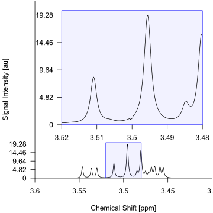
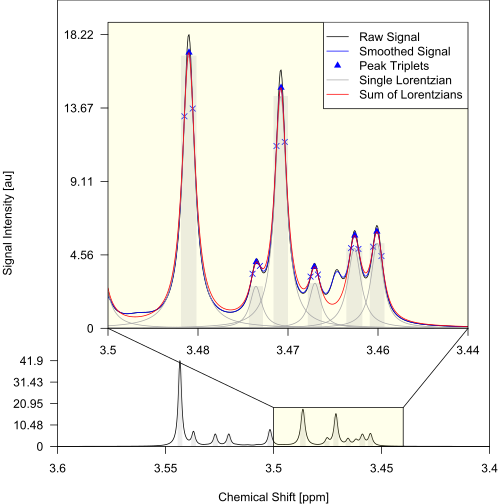
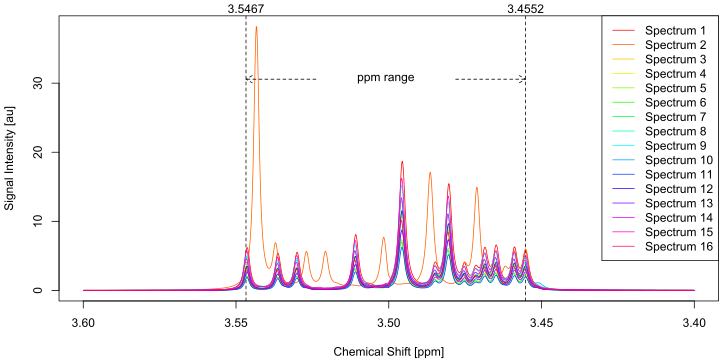

<style>
.sourceCode.txt {
  background-color: #f1f3f5;
}
figure {
  border: 1px solid #dee2e6;
  border-radius: .375rem;
  padding: 0;
  /* background-color: #f1f3f5; */
}
figcaption {
  text-align: center;
  font-style: italic;
  border-top: 1px solid #dee2e6;
  padding: 0.75rem;
  background-color: #ffffff;
}
</style>

This article shows how Metabodecon can be used for deconvoluting and aligning one-dimensional NMR spectra using the pre-installed [Sim] dataset as an example. The Sim dataset includes 16 simulated spectra, each with 1309 data points ranging from 3.6 to 3.4 ppm. These simulations closely mimic the resolution and signal strength of real NMR experiments on blood plasma from 16 individuals. The Sim dataset is used instead of the Blood dataset because it is smaller, faster to process, and comes pre-installed with the package.

- For more information on the Sim and Blood datasets, see [Datasets].
- For a description of the problems that Metabodecon tries to solve, see [Purpose].
- For an introduction into NMR spectroscopy, see [NMR-Basics].

[Sim]: https://spang-lab.github.io/metabodecon/articles/Datasets.html#sim
[Datasets]: https://spang-lab.github.io/metabodecon/articles/Datasets.html
[Purpose]: https://spang-lab.github.io/metabodecon/articles/Purpose.html
[NMR-Basics]: https://spang-lab.github.io/metabodecon/articles/NMR-Basics.html

# Deconvolute spectra

To find the path to the Sim dataset, you can use the `metabodecon_file()` function, which returns the path to any file or directory within the package directory. To deconvolute the spectra within the Sim dataset you can use `generate_lorentz_curves()`:

```R
sim_dir <- metabodecon::metabodecon_file("bruker/sim")
deconvs <- metabodecon::generate_lorentz_curves(
    data_path = sim_dir, # Path to directory containing spectra
    sfr = c(3.42, 3.58), # Borders of signal free region (SFR) in ppm
    wshw = 0,            # Half width of water signal (WS) in ppm
    smopts = c(2, 5),    # Configure smoothing parameters
    delta = 0.1          # Configure threshold for peak filtering
)
```

After calling `generate_lorentz_curves()`, the function will ask you to answer the following questions to determine the optimal deconvolution parameters:

1. Use same parameters for all spectra? (y/n)
2. Number of spectrum for adjusting parameters? (1: sim_01, 2: sim_02, ...)
3. Signal free region correctly selected? (y/n)
4. Water artefact fully inside red vertical lines? (y/n)

You can answer questions one and two with `y` and `1`, as the dataset is homogeneous, i.e., all spectra were measured in the same lab with the same acquisition and processing parameters. However, for heterogeneous datasets, it's advisable to optimize parameters for each batch of spectra individually.

Questions three and four are accompanied by two plots, shown in [Figure 1](#fig-sim01-sfr-and-wsr), which help you to verify the accuracy of the selected signal-free region (SFR) and water signal half-width (WSHW) [^wshw]. In this case, the provided parameters are already fine, so you can answer both questions with `y`. If adjustments are needed, you can respond with `n` and input the correct values.

<figure id="fig-sim01-sfr-and-wsr">

<figcaption>
<strong>Figure 1.</strong>
The first spectrum of the Sim dataset.
The x-Axis gives the chemical shift of each datapoint in parts per million (ppm).
The y-Axis gives the signal intensity of each datapoint in arbitrary units (au).
The borders of the signal free region are shown as green vertical lines in the left plot.
The center of the water signal is shown as a red vertical line in the right plot.
Because the water signal half width is set to zero, the borders of the water signal region equal its center.
</figcaption>
</figure>

When using the function in scripts, where interactive user input is not desired, you can disable the interactive prompting by setting parameter `ask` to `FALSE`. In this case, the provided parameters will be used for the deconvolution of all spectra automatically. [^askFALSE]

# Visualize deconvoluted spectra

After completing the deconvolution, it is advisable to visualize the extracted signals using `plot_spectrum()` to assess the quality of the deconvolution:

```R
# Visualize the first spectrum only
metabodecon::plot_spectrum(deconvs[[1]], foc_rgn = c(0.5, 0.2))

# Visualize all spectra and save them to a pdf file
pdfpath <- tempfile(fileext = ".pdf")
pdf(pdfpath, width = 12, height = 8)
for (i in seq_along(deconvs)) {
    metabodecon::plot_spectrum(
        decon   = deconvs[[i]],
        main    = deconvs[[i]]$filename,
        foc_rgn = c(0.25, 0.75)
    )
}
dev.off()
cat("Plots saved to", pdfpath, "\n")
```

Out of the 16 generated plots, the first two are shown as examples in [Figure 2](#fig-sim1-plots). Things to look out for are:

1. That the smoothing does not remove any real signals. If the smoothing is too strong, i.e., the smoothed signal intensity (SI) is very different from the raw SI, you should adjust the smoothing parameters `smopts` in the call to `generate_lorentz_curves()`.
2. That the superposition of the lorentz curves is a good approximation of the smoothed SI. If major peaks are missed by the algorithm, you should reduce the threshold `delta` in the call to `generate_lorentz_curves()`.

<figure id="fig-sim1-plots">
<a href="Get_Started/sim_01_spectrum.svg">
  
</a>
<a href="Get_Started/sim_02_spectrum.svg">
  
</a>
<figcaption>
<strong>Figure 2.</strong>
Deconvolution results for the first two spectra of the Sim dataset. The raw SI (black), smoothed SI (blue), and superposition of Lorentz curves (red) are closely aligned, indicating that <code>smopts</code> and <code>delta</code> were chosen well and that the deconvolution was successful.
</figcaption>
</figure>

# Align deconvoluted spectra

The general workflow for aligning a set of deconvoluted spectra is as follows:

1. Look up global maximum and minimum ppm values over all spectra
2. Generate a matrix of features based on the spectrum data
3. Align the spectra using the 'speaq' package
4. Combine signals of peaks which are spread over adjacent columns

The following code snippet shows, how the above steps can be done using the 'metabodecon' package:

## 1. Look up spectrum range

You can use function `get_ppm_range()` to determine the global maximum and minimum ppm values over all spectra. Setting `show = TRUE` will additionally create a plot showing the spectra overlayed on top of each other. The plot is shown in [Figure 3](#fig-sim-spectra-overlay).


```R
ppm_range <- get_ppm_range(spectrum_data = deconvs, show = TRUE)
```

<figure id="fig-sim1-plots">
<a href="Get_Started/sim_spectra_overlayed.svg">
  
</a>
<figcaption>
<strong>Figure 3.</strong>
Overlay of all 16 deconvoluted spectra from the Sim dataset. The x-Axis gives the chemical shift of each datapoint in parts per million (ppm). The y-Axis gives the signal intensity of each datapoint in arbitrary units (au). All specta are pretty similar to each other except for Spetrum 2, which appears to be shifted approx. 0.01 ppm to the right.
</figcaption>
</figure>


## 2. Generate feature matrix

To generate a matrix of features based on the spectrum data, you can use the `gen_feat_mat()` function. The resulting matrix will have one row for each spectrum and one column for each chemical shift. The following code snippet shows how to generate the feature matrix:

```R
feat <- gen_feat_mat(
  data_path = deconvs,
  ppm_range = ppm_range,
  si_size_real_spectrum = 1309,
  scale_factor_x = 1000
)
head(feat)
```

In the above code snippet:

- Parameter `si_size_real_spectrum` of `gen_feat_mat()` gives the number of datapoints in each spectrum. [^si]
- Parameter `scale_factor_x` of `gen_feat_mat()` gives the scaling factor that was used during the deconvolution to prevent rounding errors.

[^si]: The name `si` is derived from the Bruker parameter "#SI" which gives the number of datapoints in the spectrum.

## 3. Align spectra

```R
after_speaq_mat <- speaq_align(feat = feat, maxShift = 50)
head(after_speaq_mat)
```

Parameter `maxShift` of `speaq_align()` gives the maximum number of points along the x axis a value can be moved by the 'speaq' package. A value of 50 may be used as start value for plasma spectra. However, depending on your spectra and the used digital resolution this value may be be adapted.

## 4. Combine peaks

```R
aligned_res <- combine_peaks(
  shifted_mat = after_speaq_mat,
  range = 5, # Number of adjacent columns to be used for improving alignment
  lower_bound = 1 # Number of columns that need to be skipped
  spectrum_data = spectrum_data,
  data_path = data_path
)
str(aligned_res, 1)
head(aligned_res$long)
head(aligned_res$short)
```

The final result of the alignment `aligned_res` is a list containing two matrices:

- `long`: the aligned matrix of signal intensities. Each row corresponds to a spectrum and each column to a chemical shift.
- `short`: same as `long`, but all columns containing only zeros have been removed.

Furthermore, results are written into two .csv files in your `data_path` directory "aligned_res_short.csv" and "aligned_res_long.csv".

<!-- Footnotes -->

[^wshw]: Since the used dataset was simulated based on actual measurement in the range 3.6 to 3.4 ppm, it doesn't contain a water signal. Therefore, the water signal half width was set to zero.
[^askFALSE]: In this case it may be useful to set `ask = TRUE` for the first run to determine the optimal parameters interactively and then set `ask = FALSE` for subsequent runs.