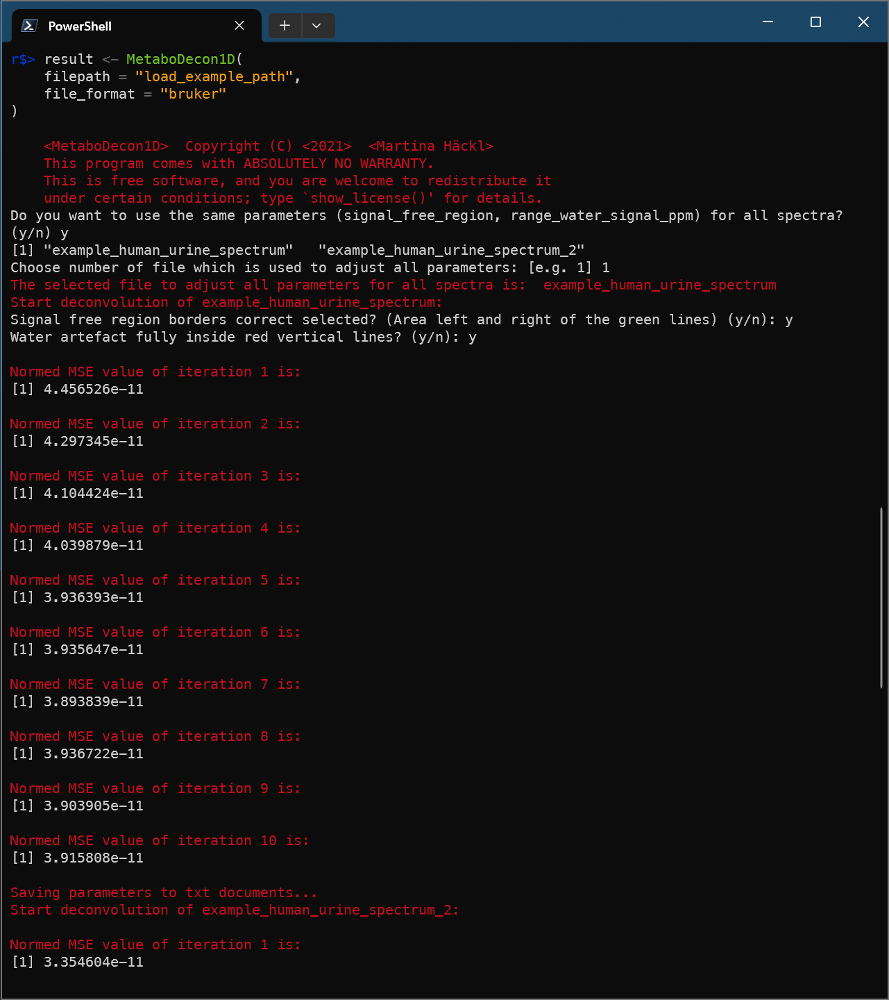

# Metabodecon1D Usage Example

The `MetaboDecon1D` package is the predecessor of this package and can be downloaded from [uni-regensburg.de/medicine/functional-genomics/staff/prof-wolfram-gronwald/software](https://www.uni-regensburg.de/medicine/functional-genomics/staff/prof-wolfram-gronwald/software/index.html). We include this usage example in here so we can easily reference old behaviour and point out added features in `metabodecon`.

## Install the package

1. Open the following link in your browser: [uni-regensburg.de/medicine/functional-genomics/staff/prof-wolfram-gronwald/software](https://www.uni-regensburg.de/medicine/functional-genomics/staff/prof-wolfram-gronwald/software/index.html)
2. Click [MetaboDecon1D: An R-package for the Deconvolution and Integration of 1D NMR data](https://genomics.ur.de/software/NMR/MetaboDecon1D/)
3. Download [MetaboDecon1D_0.2.2.tar.gz](https://genomics.ur.de/software/NMR/MetaboDecon1D/MetaboDecon1D_0.2.2.tar.gz)
4. Start an R session and enter command `install.packages("C:/Users/tobi/Downloads/MetaboDecon1D_0.2.2.tar.gz", repos = NULL, type = "source")` (replace `C:/Users/tobi/Downloads/MetaboDecon1D_0.2.2.tar.gz` with the path to the downloaded file on your computer)


## Load package

```R
library(MetaboDecon1D)
```

## Deconvolute one spectrum in Bruker format

```R
# Do the deconvolution
result <- MetaboDecon1D(
    filepath = "load_example_path",
    filename = "example_human_urine_spectrum",
    file_format = "bruker"
)

# Visualize results and store plots as png
str(result)
plot_triplets(result)
plot_lorentz_curves_save_as_png(result)
plot_spectrum_superposition_save_as_png(result)
```





## Deconvolute one spectrum in jcamp-dx format

```R
result <- MetaboDecon1D(
    filepath = "load_example_path",
    filename = "example_human_urine_spectrum.dx",
    file_format = "jcampdx"
)
str(result)
```


## Deconvolute multiple spectra in Bruker format

```R
result <- MetaboDecon1D(
    filepath = "load_example_path",
    file_format = "bruker"
)
str(result)
```


## Deconvolute multiple spectra in jcamp-dx format


```R
jcamp_results <- MetaboDecon1D(
    filepath = "load_example_path",
    file_format = "jcampdx"
)
plot_triplets(jcamp_results)
```


